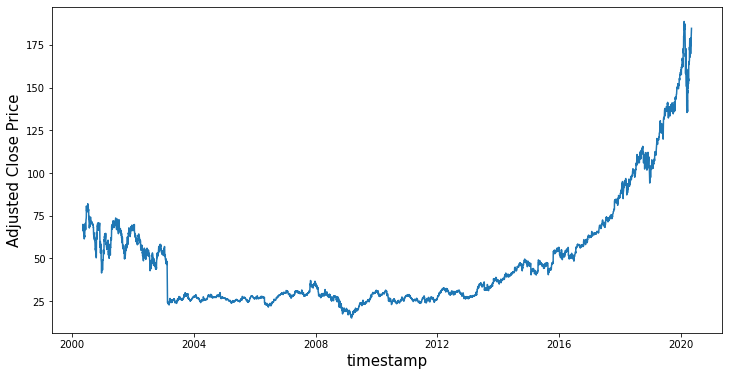
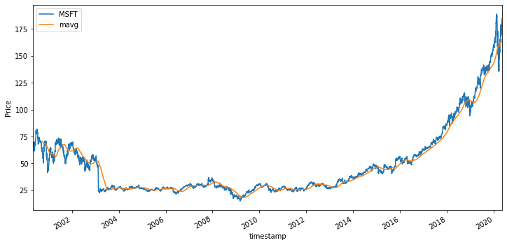
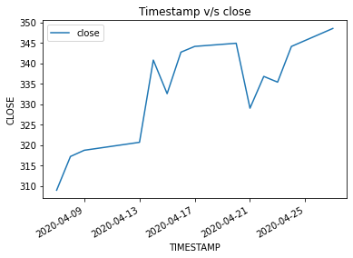
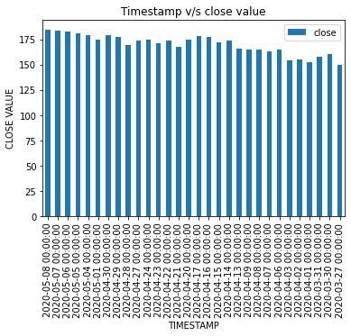
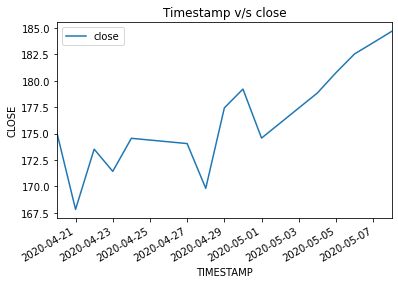
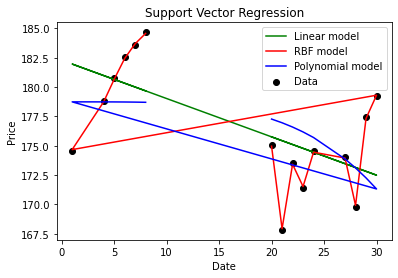

```python
# The goal of this project is to understand stock dataset of a particular company and then analyse
# the dataset to predict the future price. The prediction of stock market is very cumbersome process. 
# So, in this work I am implementing Support Vector Regression method. I am using three models,
# Linear Regression, Radical Basic Function and Polynomial Regression models.
```


```python
# Importing dependencies
import requests
import json
import csv
import numpy as np
import pandas as pd
```


```python
# First of all I am fetching Data from Alpha Vantage API,
# I am fetching Stock data for Microsoft since last 20years to till date.
```


```python
# Collecting stock data of Microsoft using Alpha Vantage API
CSV_URL ="https://www.alphavantage.co/query?function=TIME_SERIES_DAILY&symbol=MSFT&apikey=NR8HXOOB06DUO2M3&datatype=csv&outputsize=full"
with requests.Session() as s:
    download = s.get(CSV_URL)
    print(download)
    decoded_content = download.content.decode('utf-8')

    cr = csv.reader(decoded_content.splitlines(), delimiter=',')
    df = pd.DataFrame(cr)
df
new_header = df.iloc[0] #grab the first row for the header
df = df[1:] #take the data less the header row
df.columns = new_header
df.head()
```

    <Response [200]>


<div>
<style scoped>
    .dataframe tbody tr th:only-of-type {
        vertical-align: middle;
    }

    .dataframe tbody tr th {
        vertical-align: top;
    }

    .dataframe thead th {
        text-align: right;
    }
</style>
<table border="1" class="dataframe">
  <thead>
    <tr style="text-align: right;">
      <th></th>
      <th>timestamp</th>
      <th>open</th>
      <th>high</th>
      <th>low</th>
      <th>close</th>
      <th>volume</th>
    </tr>
  </thead>
  <tbody>
    <tr>
      <th>1</th>
      <td>2020-05-08</td>
      <td>184.9797</td>
      <td>185.0000</td>
      <td>183.3600</td>
      <td>184.6800</td>
      <td>30912638</td>
    </tr>
    <tr>
      <th>2</th>
      <td>2020-05-07</td>
      <td>184.1700</td>
      <td>184.5500</td>
      <td>182.5800</td>
      <td>183.6000</td>
      <td>28315992</td>
    </tr>
    <tr>
      <th>3</th>
      <td>2020-05-06</td>
      <td>182.0800</td>
      <td>184.2000</td>
      <td>181.6306</td>
      <td>182.5400</td>
      <td>32139299</td>
    </tr>
    <tr>
      <th>4</th>
      <td>2020-05-05</td>
      <td>180.6200</td>
      <td>183.6500</td>
      <td>179.9000</td>
      <td>180.7600</td>
      <td>36839168</td>
    </tr>
    <tr>
      <th>5</th>
      <td>2020-05-04</td>
      <td>174.4900</td>
      <td>179.0000</td>
      <td>173.8000</td>
      <td>178.8400</td>
      <td>30372862</td>
    </tr>
  </tbody>
</table>
</div>


```python
# Once the data is collected I am applying Data Preprocessing methods to clean data.
# Data Type of the columns
dataTypeOfColumns = df.dtypes
print(dataTypeOfColumns)
```

    0
    timestamp    object
    open         object
    high         object
    low          object
    close        object
    volume       object
    dtype: object


```python
# Checking if columns are unique column
columns = list(df)
for i in columns:
    print(i , "-", df[i].nunique() == df[i].count())
```

    timestamp - True
    open - False
    high - False
    low - False
    close - False
    volume - False


```python
# Finding if there is any NaN value
df.isnull().values.any()
```


    False


```python
# Updating Datatypes of the columns
df['timestamp'] = pd.to_datetime(df['timestamp'])
df.open=df.open.astype(float)
df.high=df.high.astype(float)
df.low=df.low.astype(float)
df.close=df.close.astype(float)
df.volume=df.volume.astype(int)
df.dtypes
```


    0
    timestamp    datetime64[ns]
    open                float64
    high                float64
    low                 float64
    close               float64
    volume                int64
    dtype: object


```python
# By taking average of the high and low value I am calculating a mid or 
# average value of the stock for a particular day
df['average_value'] = df[['high', 'low']].mean(axis=1)
df.head(10)
```


<div>
<style scoped>
    .dataframe tbody tr th:only-of-type {
        vertical-align: middle;
    }

    .dataframe tbody tr th {
        vertical-align: top;
    }

    .dataframe thead th {
        text-align: right;
    }
</style>
<table border="1" class="dataframe">
  <thead>
    <tr style="text-align: right;">
      <th></th>
      <th>timestamp</th>
      <th>open</th>
      <th>high</th>
      <th>low</th>
      <th>close</th>
      <th>volume</th>
      <th>average_value</th>
    </tr>
  </thead>
  <tbody>
    <tr>
      <th>1</th>
      <td>2020-05-08</td>
      <td>184.9797</td>
      <td>185.00</td>
      <td>183.3600</td>
      <td>184.68</td>
      <td>30912638</td>
      <td>184.1800</td>
    </tr>
    <tr>
      <th>2</th>
      <td>2020-05-07</td>
      <td>184.1700</td>
      <td>184.55</td>
      <td>182.5800</td>
      <td>183.60</td>
      <td>28315992</td>
      <td>183.5650</td>
    </tr>
    <tr>
      <th>3</th>
      <td>2020-05-06</td>
      <td>182.0800</td>
      <td>184.20</td>
      <td>181.6306</td>
      <td>182.54</td>
      <td>32139299</td>
      <td>182.9153</td>
    </tr>
    <tr>
      <th>4</th>
      <td>2020-05-05</td>
      <td>180.6200</td>
      <td>183.65</td>
      <td>179.9000</td>
      <td>180.76</td>
      <td>36839168</td>
      <td>181.7750</td>
    </tr>
    <tr>
      <th>5</th>
      <td>2020-05-04</td>
      <td>174.4900</td>
      <td>179.00</td>
      <td>173.8000</td>
      <td>178.84</td>
      <td>30372862</td>
      <td>176.4000</td>
    </tr>
    <tr>
      <th>6</th>
      <td>2020-05-01</td>
      <td>175.8000</td>
      <td>178.64</td>
      <td>174.0100</td>
      <td>174.57</td>
      <td>39370474</td>
      <td>176.3250</td>
    </tr>
    <tr>
      <th>7</th>
      <td>2020-04-30</td>
      <td>180.0000</td>
      <td>180.40</td>
      <td>176.2300</td>
      <td>179.21</td>
      <td>53875857</td>
      <td>178.3150</td>
    </tr>
    <tr>
      <th>8</th>
      <td>2020-04-29</td>
      <td>173.2200</td>
      <td>177.68</td>
      <td>171.8800</td>
      <td>177.43</td>
      <td>51286559</td>
      <td>174.7800</td>
    </tr>
    <tr>
      <th>9</th>
      <td>2020-04-28</td>
      <td>175.4556</td>
      <td>175.67</td>
      <td>169.3900</td>
      <td>169.81</td>
      <td>34392694</td>
      <td>172.5300</td>
    </tr>
    <tr>
      <th>10</th>
      <td>2020-04-27</td>
      <td>176.5900</td>
      <td>176.90</td>
      <td>173.3000</td>
      <td>174.05</td>
      <td>33194384</td>
      <td>175.1000</td>
    </tr>
  </tbody>
</table>
</div>


```python
# Rearranging Columns
column_titles = ['timestamp','open','high','average_value','low','close','volume']
df.reindex(columns = column_titles)
df.head()
```


<div>
<style scoped>
    .dataframe tbody tr th:only-of-type {
        vertical-align: middle;
    }

    .dataframe tbody tr th {
        vertical-align: top;
    }

    .dataframe thead th {
        text-align: right;
    }
</style>
<table border="1" class="dataframe">
  <thead>
    <tr style="text-align: right;">
      <th></th>
      <th>timestamp</th>
      <th>open</th>
      <th>high</th>
      <th>low</th>
      <th>close</th>
      <th>volume</th>
      <th>average_value</th>
    </tr>
  </thead>
  <tbody>
    <tr>
      <th>1</th>
      <td>2020-05-08</td>
      <td>184.9797</td>
      <td>185.00</td>
      <td>183.3600</td>
      <td>184.68</td>
      <td>30912638</td>
      <td>184.1800</td>
    </tr>
    <tr>
      <th>2</th>
      <td>2020-05-07</td>
      <td>184.1700</td>
      <td>184.55</td>
      <td>182.5800</td>
      <td>183.60</td>
      <td>28315992</td>
      <td>183.5650</td>
    </tr>
    <tr>
      <th>3</th>
      <td>2020-05-06</td>
      <td>182.0800</td>
      <td>184.20</td>
      <td>181.6306</td>
      <td>182.54</td>
      <td>32139299</td>
      <td>182.9153</td>
    </tr>
    <tr>
      <th>4</th>
      <td>2020-05-05</td>
      <td>180.6200</td>
      <td>183.65</td>
      <td>179.9000</td>
      <td>180.76</td>
      <td>36839168</td>
      <td>181.7750</td>
    </tr>
    <tr>
      <th>5</th>
      <td>2020-05-04</td>
      <td>174.4900</td>
      <td>179.00</td>
      <td>173.8000</td>
      <td>178.84</td>
      <td>30372862</td>
      <td>176.4000</td>
    </tr>
  </tbody>
</table>
</div>


```python
# sort by date
df_new = df.copy()
df_new = df_new.sort_values('timestamp')

# fix the date 
df_new.reset_index(inplace=True)
df_new.set_index("timestamp", inplace=True)

df_new.tail()
```


<div>
<style scoped>
    .dataframe tbody tr th:only-of-type {
        vertical-align: middle;
    }

    .dataframe tbody tr th {
        vertical-align: top;
    }

    .dataframe thead th {
        text-align: right;
    }
</style>
<table border="1" class="dataframe">
  <thead>
    <tr style="text-align: right;">
      <th></th>
      <th>index</th>
      <th>open</th>
      <th>high</th>
      <th>low</th>
      <th>close</th>
      <th>volume</th>
      <th>average_value</th>
    </tr>
    <tr>
      <th>timestamp</th>
      <th></th>
      <th></th>
      <th></th>
      <th></th>
      <th></th>
      <th></th>
      <th></th>
    </tr>
  </thead>
  <tbody>
    <tr>
      <th>2020-05-04</th>
      <td>5</td>
      <td>174.4900</td>
      <td>179.00</td>
      <td>173.8000</td>
      <td>178.84</td>
      <td>30372862</td>
      <td>176.4000</td>
    </tr>
    <tr>
      <th>2020-05-05</th>
      <td>4</td>
      <td>180.6200</td>
      <td>183.65</td>
      <td>179.9000</td>
      <td>180.76</td>
      <td>36839168</td>
      <td>181.7750</td>
    </tr>
    <tr>
      <th>2020-05-06</th>
      <td>3</td>
      <td>182.0800</td>
      <td>184.20</td>
      <td>181.6306</td>
      <td>182.54</td>
      <td>32139299</td>
      <td>182.9153</td>
    </tr>
    <tr>
      <th>2020-05-07</th>
      <td>2</td>
      <td>184.1700</td>
      <td>184.55</td>
      <td>182.5800</td>
      <td>183.60</td>
      <td>28315992</td>
      <td>183.5650</td>
    </tr>
    <tr>
      <th>2020-05-08</th>
      <td>1</td>
      <td>184.9797</td>
      <td>185.00</td>
      <td>183.3600</td>
      <td>184.68</td>
      <td>30912638</td>
      <td>184.1800</td>
    </tr>
  </tbody>
</table>
</div>


```python
# Visualizing the training stock data:
import matplotlib.pyplot as plt
%matplotlib inline

plt.figure(figsize = (12,6))
plt.plot(df_new["close"])
plt.xlabel('timestamp',fontsize=15)
plt.ylabel('Adjusted Close Price',fontsize=15)
plt.show()


# Rolling mean
close_px = df_new['close']
mavg = close_px.rolling(window=100).mean()

plt.figure(figsize = (12,6))
close_px.plot(label='MSFT')
mavg.plot(label='mavg')
plt.xlabel('timestamp')
plt.ylabel('Price')
plt.legend()
```

    /usr/local/lib/python3.7/site-packages/pandas/plotting/_converter.py:129: FutureWarning: Using an implicitly registered datetime converter for a matplotlib plotting method. The converter was registered by pandas on import. Future versions of pandas will require you to explicitly register matplotlib converters.
    
    To register the converters:
    	>>> from pandas.plotting import register_matplotlib_converters
    	>>> register_matplotlib_converters()
      warnings.warn(msg, FutureWarning)





    <matplotlib.legend.Legend at 0x11383e9d0>





```python
# Plotting curve TimeStamp v/s Volume
import matplotlib.pyplot as plt
%matplotlib inline
df_updated = df.head(30)
df_updated.plot(kind='line',x = "timestamp",y = "volume")
plt.title('Timestamp v/s Volume curve')
plt.xlabel('TIMESTAMP')
plt.ylabel('STOCK VOLUME')
plt.show()
```





```python
# Plotting Bar Graph between TimeStamp and Close Value
import matplotlib.pyplot as plt

df_updated = df.head(30)

df_updated.plot(kind='bar',x = "timestamp",y = "close")
plt.title('Timestamp v/s close value')
plt.xlabel('TIMESTAMP')
plt.ylabel('CLOSE VALUE')
plt.show()

```





```python
# Plotting curve TimeStamp v/s Close Value
# Here I am updating df_updated by collecting data of the recent 15 days.
df_updated = df.head(15)
df_updated.plot(kind='line',x = "timestamp",y = "close")
plt.title('Timestamp v/s close')
plt.xlabel('TIMESTAMP')
plt.ylabel('CLOSE')
plt.show()
```





```python
# importing dependencies
from sklearn.svm import SVR 
%matplotlib inline
```


```python
# Get data function
def get_data(df):  
    df.timestamp = df.timestamp.astype(str)
    data = df.copy()
    data['timestamp'] = data['timestamp'].str.split('-').str[2]
    data['timestamp'] = pd.to_numeric(data['timestamp'])
    return [ data['timestamp'].tolist(), data['close'].tolist() ] 
# Convert Series to list
dates, prices = get_data(df_updated)
```

    /usr/local/lib/python3.7/site-packages/pandas/core/generic.py:5096: SettingWithCopyWarning: 
    A value is trying to be set on a copy of a slice from a DataFrame.
    Try using .loc[row_indexer,col_indexer] = value instead
    
    See the caveats in the documentation: http://pandas.pydata.org/pandas-docs/stable/indexing.html#indexing-view-versus-copy
      self[name] = value


```python
# Use of three models: linear, polynomial and radial basic function (default kernal for SVR)
def predict_prices(dates, prices, x):
    dates = np.reshape(dates,(len(dates), 1)) # convert to 1xn dimension
    x = np.reshape(x,(len(x), 1))
    
    svr_lin  = SVR(kernel='linear', C=1e3)
    svr_poly = SVR(kernel='poly', C=1e3, degree=4)
    svr_rbf = SVR(kernel='rbf', C=1e3, gamma=0.5)
    
    # Fit regression model
    svr_lin.fit(dates, prices)
    svr_poly.fit(dates, prices)
    svr_rbf.fit(dates, prices)
    
    plt.scatter(dates, prices, c='k', label='Data')
    plt.plot(dates, svr_lin.predict(dates), c='g', label='Linear model')
    plt.plot(dates, svr_rbf.predict(dates), c='r', label='RBF model')    
    plt.plot(dates, svr_poly.predict(dates), c='b', label='Polynomial model')
    
    plt.xlabel('Date')
    plt.ylabel('Price')
    plt.title('Support Vector Regression')
    plt.legend()
    plt.show()
    
    return svr_rbf.predict(x)[0], svr_lin.predict(x)[0], svr_poly.predict(x)[0]
```


```python
# Predicted Price for the date 8th May
predicted_price = predict_prices(dates, prices, [8])
print(predicted_price)
```





    (184.58033125415622, 179.67947368419476, 178.7048106878189)


```python
predicted_price = list(predicted_price)
print(predicted_price)
```

    [184.58033125415622, 179.67947368419476, 178.7048106878189]


```python
# Calculating Root Mean Square Error
from sklearn.metrics import mean_squared_error
from math import sqrt
actual_value = df['close'].at[1]
type(actual_value)
actual_value = actual_value.item()
# Actual_Value fetching from the dataframe
print('Actual Value: ', actual_value)
# Predicted_Value from Linear Regression model
predicted_value_RBFRegression = predicted_price[0]
predicted_value_linearRegression = predicted_price[1]
predicted_value_polynomial = predicted_price[2]
print('Predicted value from Radical Basic Model: ', predicted_value_RBFRegression)
print('Predicted value from Linear Regression Model: ', predicted_value_linearRegression)
print('Predicted value from Polynomial Model: ', predicted_value_polynomial)
actual_value1 = []
actual_value1.append(actual_value)
predicted_value1 = []
predicted_value1.append(predicted_value_linearRegression)
# Mean Square Error
mse = mean_squared_error(actual_value1, predicted_value1)
rmse = sqrt(mse)
print("Root Mean Square Error value: ", rmse)
```

    Actual Value:  184.68
    Predicted value from Radical Basic Model:  184.58033125415622
    Predicted value from Linear Regression Model:  179.67947368419476
    Predicted value from Polynomial Model:  178.7048106878189
    Root Mean Square Error value:  5.000526315805246


```python
# The results shows that all the three models provides very close results to the actual value,
# when we do analysis on the last 15days data, 
# This proves Support Vector Regression method models provides very good accuracy and least root mean square values.
```


```python
# References: 
# https://itnext.io/learning-data-science-predict-stock-price-with-support-vector-regression-svr-2c4fdc36662
# https://towardsdatascience.com/walking-through-support-vector-regression-and-lstms-with-stock-price-prediction-45e11b620650
```


```python

```
